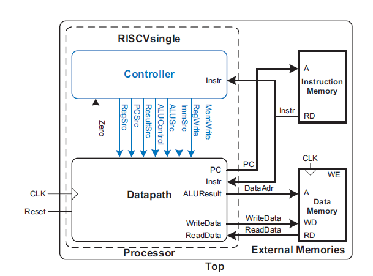
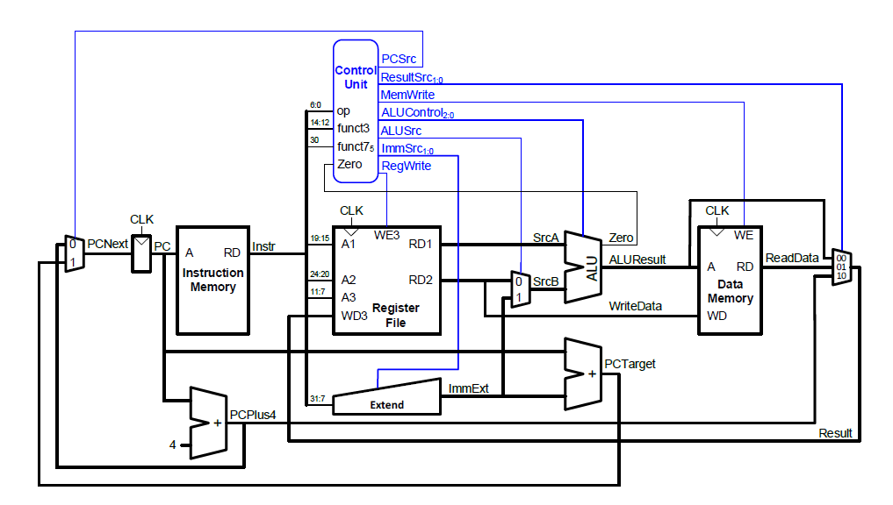
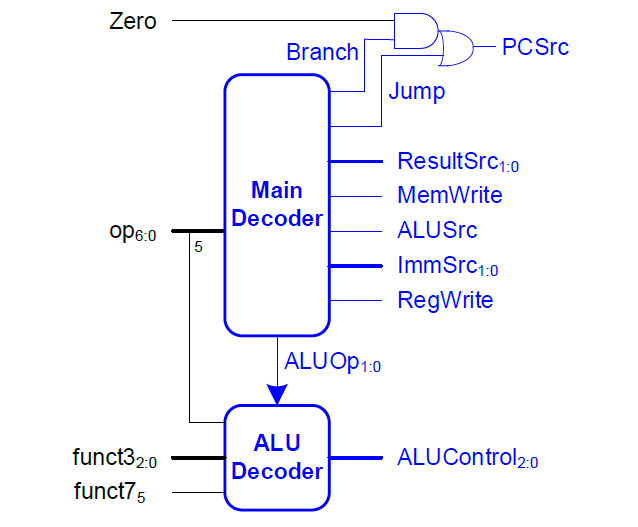
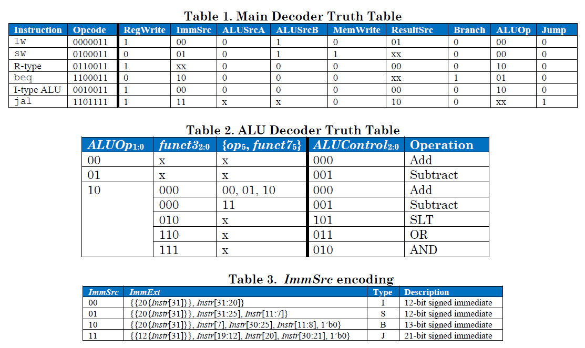
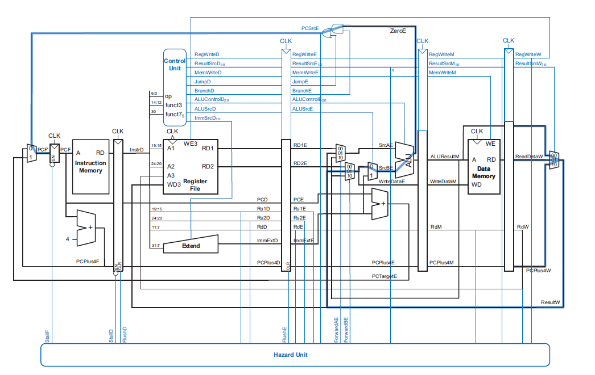
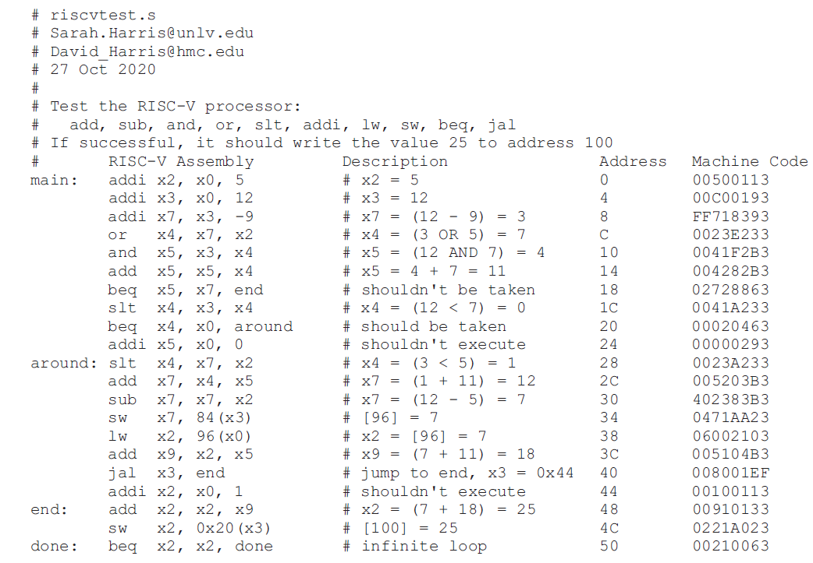

# RISC-V five stages CPU
This is a project based on the book "Digital design and computer architure RISC-V edition".
I use Verilog to build the RISC-V CPU with five stages pipeline. This processor is Harvard architecture which means the instruction memory and data memory is split.
Harvard Architecture:

## Document strcture
- `mips` have two verilog file about MIPS CPU which from the website `www.ddcabook.com`.
- `src_single` have all verilog file about single-cycle RISC-V processor. This CPU is implemented as 32-bit RISC-V(RV32i) architecture. The instruction that this tiny CPU can run now are `sw,lw,add,sub,and,or,slt,addi,ori,slti,beq,jal`.
Single-cycle Processor Architecture:

Control Unit:

The Decoder and Encoding is 

- `src_mini_pipeline` is verilog file about RISC-V CPU with five stages pipeline, and it can also run same basic instruction as single-cycle. This processor have a hazard unit to solves data hazard, structure hazard, and control hazard, and supports stalling, flushing and forwarding. I will expand architecture in the future to make it run all RV32i instruction.
Pipelined Processor Architecture with hazard unit:

- `sim` is simulation folder. The testbench file store in this folder. The testbench loads a program into the memories. This program exercises all of the instructions by performing a computation that should produce the correct result only if all of the instructions are functioning correctly. The machine code is stored in a text file called `RISCVtest.txt` in every src folder which is loaded by the testbench during simulation.
RISCVtest:

- `result` have the screenshots of waveform result.
